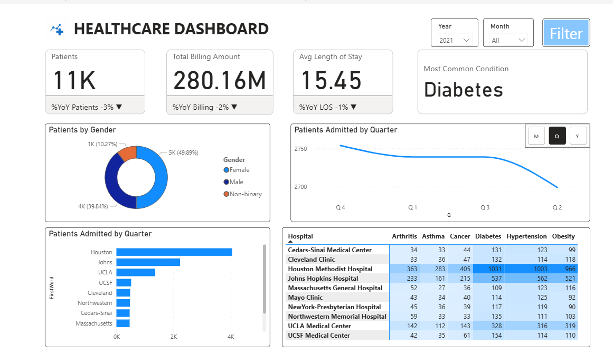

# Healthcare Dashboard - Power BI

## Overview
A Power BI dashboard for monitoring hospital performance, patient metrics, billing, length of stay (LOS), and medications.



## Features
- Total patients and admissions  
- Billing trends and Year-over-Year (%YoY) comparisons  
- Average Length of Stay (LOS)  
- Top hospitals, doctors, and admission types  
- Medication tracking per patient  

## Data Model
- **Fact Hospital**: Billing, admission/discharge dates, doctor, hospital coordinates, medications, patient ID  
- **Dim Patient**: Admission type, age, blood type, gender, insurance, medical condition, patient ID  
- **Dim Hospital**: Hospital names and coordinates  
- **Dim Medication**: Medication names  
- **DateTable**: Dates for time intelligence  

## Getting Started
1. Clone the repo:
```bash
git clone https://github.com/your-username/healthcare-dashboard.git
